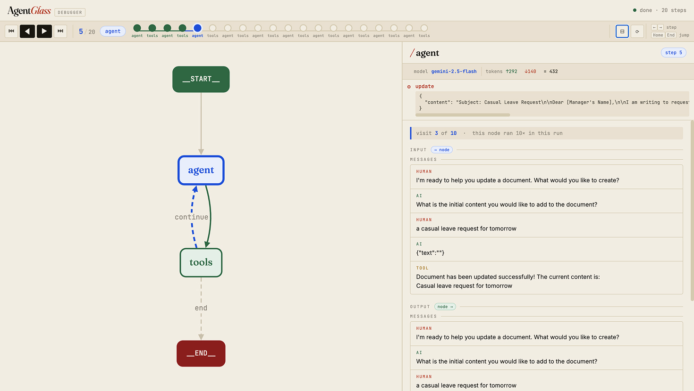

# AgentGlass

**A local, step-through visual debugger for LangGraph agents.**

AgentGlass renders your agent's execution as an interactive graph — live, in your browser, with zero cloud dependency. Step forward and backward through every node execution, inspect exact input/output state at each step, and see inside nodes: the LLM call, its token counts, model name, and every tool call it made. One `with` block. No login. No data leaves your machine.



---

## Features

- **Step-through debugger** — IDE-style ◀ ▶ controls to walk through the execution one node at a time. Click any dot on the timeline to jump to any step.
- **Live graph** — nodes highlight blue (active), green (done), red (errored) as the run progresses. Edges trace the path taken.
- **Click-to-inspect** — click any node to see the exact state that went in and the update that came out.
- **Nested sub-runs** — expand inside `agent` or `tools` to see the LLM call, token counts, model name, and tool calls — like LangSmith's waterfall, but local.
- **Gemini-aware formatting** — message arrays render as a chat transcript with role badges, function-call/response pairing, and finish-reason warnings.
- **Zero egress** — runs entirely on localhost. Nothing is sent anywhere.

---

## Installation

AgentGlass uses [uv](https://docs.astral.sh/uv/) for dependency management.

```bash
# Add to your project
uv add agentglass

# Or install globally
uv tool install agentglass
```

**From source:**

```bash
git clone https://github.com/yourname/agentglass
cd agentglass
uv sync
uv pip install -e .
```

**Dependencies** (installed automatically): `fastapi`, `uvicorn`, `langchain-core`, `langgraph`, `websockets`.

---

## Quickstart

Wrap your compiled graph in `trace()`. That's the entire integration.

```python
from agentglass import trace

compiled = your_graph.compile()

with trace(compiled, port=8765):
    result = compiled.invoke({"input": "..."})
```

A browser tab opens at `http://localhost:8765`. Step through the run, click nodes, inspect state. Press `Ctrl-C` when done.

---

## Examples

### Mock agent (no API key needed)

Good for exploring the UI without any credentials. Simulates a Gemini-style tool-calling loop.

```bash
uv run examples/mock_agent.py
```

```python
# examples/mock_agent.py
from agentglass import trace
from langgraph.graph import StateGraph, END
# ... build a graph with planner → tool_executor → planner loop

with trace(compiled, port=8765):
    compiled.invoke(initial_state)
```

The mock agent runs a `planner → tool_executor → planner` loop twice, so you can see the visit-count badges and step through all 5 executions.

---

### Real Gemini agent

```bash
export GOOGLE_API_KEY=your-key
uv run examples/gemini_react_agent.py
```

```python
# examples/gemini_react_agent.py
import os
from agentglass import trace
from langchain_google_genai import ChatGoogleGenerativeAI
from langgraph.graph import StateGraph, END
from langgraph.prebuilt import ToolNode

model = ChatGoogleGenerativeAI(model="gemini-2.5-flash", temperature=0)
# ... define tools, nodes, edges ...

with trace(compiled, port=8765):
    result = compiled.invoke({
        "messages": [HumanMessage(content="What's the weather in Tokyo and London?")]
    })
```

Clicking the `agent` node at any step shows the nested LLM call — model name (`gemini-2.5-flash`), token counts (`↑406 ↓333 = 739`), and the tool calls it requested. Clicking `tools` shows each tool that ran and what it returned.

---

### Existing project (drop-in)

If you have an existing LangGraph agent, no changes to your node functions are required:

```python
from agentglass import trace

# your existing code — untouched
app = graph.compile()

# wrap it
with trace(app, port=8765):
    for step in app.stream(state, stream_mode="values"):
        print_messages(step.get("messages", []))
```

---

## How it works

```
your agent                AgentGlass               browser
──────────                ──────────               ───────
graph.compile()  ──────►  extract graph structure
                          attach callback tracer
compiled.invoke() ──────► on_chain_start  ────────► WebSocket event
                          on_chat_model_start        → node lights up
                          on_llm_end                 → LLM child recorded
                          on_tool_start/end           → tool child recorded
                          on_chain_end  ──────────►  WebSocket event
                                                     → node turns green
                                                     → step available
user clicks node  ◄────────────────────────────────  REST /api/events
```

The tracer uses a **node stack** to associate sub-runs (LLM calls, tool executions, condition functions) with their parent node — this works correctly even on LangGraph 1.x, which reuses the same `run_id` across an entire invocation.

---

## UI walkthrough

| Control | Action |
|---|---|
| `▶` / `◀` | Step forward / backward |
| `⏮` / `⏭` | Jump to first / last step |
| `←` `→` keyboard | Step forward / backward |
| `Home` / `End` | Jump to first / last step |
| Click a timeline dot | Jump to that step |
| Click a node in the graph | Jump to that node's most recent execution |
| Click `▸` on a sub-run row | Expand input / output / tool args |

---

## Roadmap

These are not in the current release but are planned or under consideration:

- **State diff view** — between consecutive visits to the same node, highlight exactly which keys changed
- **Time-travel** — pause at a node, edit state, resume
- **Multi-run comparison** — load two runs side by side and see where they diverged
- **Persistence** — SQLite backend so runs survive server restarts; a history page
- **Cost / latency overlay** — token cost and wall-clock time badges on each node
- **Export** — bundle a run into a self-contained HTML file for sharing
- **Framework expansion** — CrewAI, raw LangChain Runnable graphs

---

## Contributing

Contributions are welcome! AgentGlass is designed with clear separation of concerns — most changes touch only one component.

```bash
# Quick setup
git clone https://github.com/subhranil2605/agentglass
cd agentglass
uv sync
uv run pytest tests/ -v
```

See **[CONTRIBUTING.md](CONTRIBUTING.md)** for:

- Development setup and architecture overview
- Code style and testing guidelines
- How to report bugs and propose features

See **[PULL_REQUEST_GUIDELINES.md](PULL_REQUEST_GUIDELINES.md)** for our Glass-themed PR philosophy.

---

## License

MIT — see [LICENSE](LICENSE).